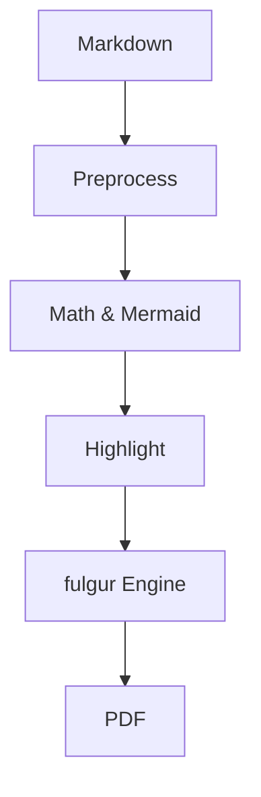

# TypePress — All-Features Markdown Example

A document exercising the full TypePress pipeline: Markdown structure,
tables, code highlighting, math, mermaid, emoji, and CJK text.

## Headings, Quotes, and Lists

> TypePress renders Markdown without a browser — deterministic output,
> no headless-Chromium memory cost.

### Unordered list

- First item
- Second item
  - Nested item A
  - Nested item B
- Third item

### Ordered list

1. One
2. Two
3. Three

## Tables with Alignment

| Feature | TypePress | wkhtmltopdf |
| :--- | :---: | ---: |
| Math (KaTeX) | ✅ | ❌ |
| Mermaid | ✅ | ❌ |
| Markdown input | ✅ | ❌ |
| Binary size | ~15MB | ~40MB |

## Fenced Code with Syntax Highlighting

```rust
fn main() {
    let msg = "hello from typepress";
    println!("{msg}");
}
```

```python
def fib(n: int) -> int:
    return n if n < 2 else fib(n - 1) + fib(n - 2)
```

## Math

Inline math: the energy–mass equivalence $E = mc^2$.

Display math:

$$
\int_0^\infty e^{-x^2} \, dx = \frac{\sqrt{\pi}}{2}
$$

## Mermaid



## Emoji and CJK

TypePress ships KaTeX math fonts and falls back to system fonts for
everything else — 中文内容、日本語、한국어, and emoji 🎉 all work.

## Links and Images

[TypePress on GitHub](https://github.com/alitrack/typepress)

---

*End of example.*
